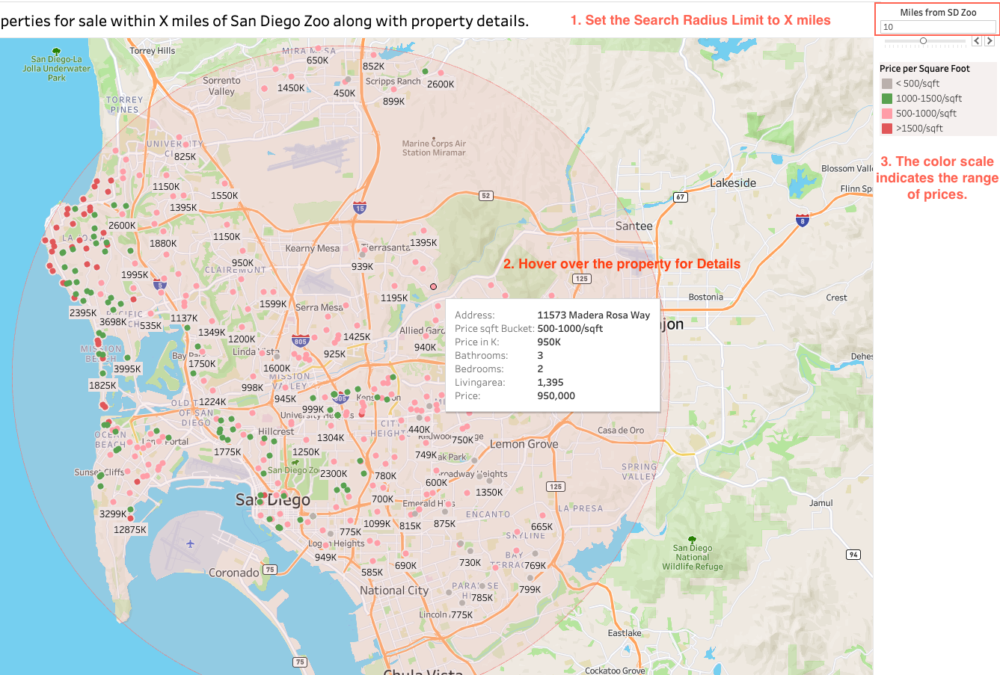
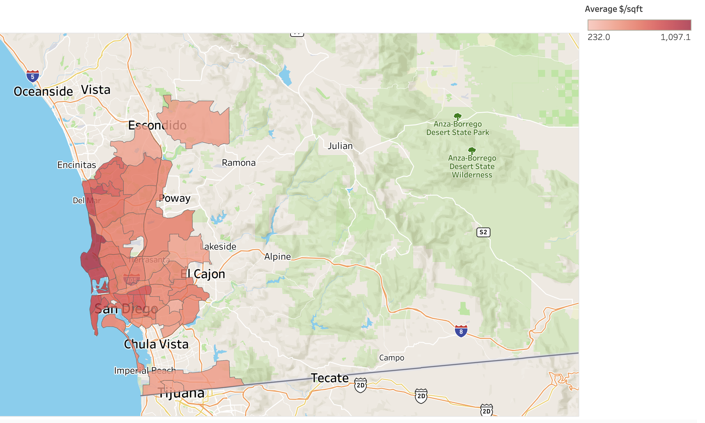

# San Diego Zillow Housing Data Pipeline Project

### Why I Chose to Study San Diego Housing Market Data?

If you've been following the US real estate market during COVID-19, you've seen that the price has risen sharply. San Diego's no different, with remote work boosting house prices as people move to the city. Limited housing inventory adds to the competition. Looking to buy in San Diego? This project gathers all available properties for sale, making your search easier.

### Project Summary

* This pipeline fetches all San Diego property data from Zillow.com using Rapid API.
* The data is stored in an Amazon S3 bucket in CSV format after cleaning and transformation with Python. 
* Snowpipe automatically loads this data into a Snowflake warehouse for SQL analysis.
* Finally, Tableau is used to visualize the properties for sale, showcasing details like price, bathrooms, bedrooms, and address.

### Tools & Technologies

* __Airflow__: Data Orchestration
* __Python__: Requests data from Zillow API and processes & transform it
* __Amazon S3__: Cloud Storage for raw data and processed zillow 
* __Snowflake & Snowpipe__: Automates data flow from S3 to data warehouse and enables data analysis in data warehouse
* __Tableau__: Visualizes all sales properties based on dynamic parameters selected

### Diagram of the Data Pipeline

### Visualization

This Tableau dashboard showcases current properties for sale in San Diego, centered around a location of your choice, like San Diego Zoo. Often, when people search for potential properties, they aim to be near specific locations such as their workplace or their children's school. This dashboard facilitates this search by allowing users to set a radius limit (X miles) from their chosen center location. Viewers can set a radius limit for their search (e.g., X miles) from this center point. The dashboard displays all available properties within this radius, color-coded by price per square foot. Hovering over a property reveals key details like address, bedrooms, bathrooms, and listing price.

Check out the dynamic dashboard on Tableau Public [here.](https://public.tableau.com/app/profile/shumeng.shi/viz/SanDiegoZonePropertySalesAnalysis/ZillowDataMap)

The second visualization shows the average price per square foot for each zip code. The darker the shade of red, the higher the price. It's clear that areas closer to the beach have higher average prices.

### Technical Details

#### Part 1: Get data via API + Transform + Storage in S3
An [Airflow DAG](./airflow/dags/zillow_analytics.py) orchestrates all the tasks mentioned above, and it consists of a total of 7 individual tasks:
1. zillow_sale_data : Retrieve property data labeled as "forSale" from zillow.com using the RAPID API 
2. zillow_sold_data: Retrieve property data labeled as "RecentlySold" from zillow.com using the RAPID API
3. zillow_rent_data: Retrieve property listings labeled as "forRent" from zillow.com using the RAPID API
4. combine_zillow: Merge multiple CSV files generated from the preceding 3 steps into a single large CSV file
5. remove_duplicate: Remove duplicate entries of properties based on their unique identifier (zpid), considering that some properties may have records for both being available for rent and recently sold
6. upload_raw_to_s3: Once the duplicate records are removed, upload the raw data in CSV format to the S3 raw bucket
7. data_transform: Clean the data by filling in missing values, excluding outliers, and performing other necessary transformation
8. upload_transform_to_s3: Upload the processed data to the S3 transform bucket in CSV format

#### Part 2: Create Snowflake Warehouse + SnowPipe

> What is Snowpipe?
>> Snowpipe is a data ingestion service offered by Snowflake. In this project,whenever a new file is added to the specified S3 buckets, AWS S3 sends a notification to Snowpipe. Snowpipe then copies the file from the S3 bucket to a table in the Snowflake warehouse.

You can find the SQL file that handles the process in the [snowflake folder](./snowflake/snowflake_sql.sql)

### Instructions for Reproduce

#### Accounts for Tools Needed:
1. Sign up for the free tier of Amazon AWS to access S3, which gives you 5 GB of storage per month.
2. Sign up for Snowflake free trial.
3. Create an account on Rapid API and subscribe to the [zillow.com API.](https://rapidapi.com/ntd119/api/zillow-com4/)
4. Install Airflow on your local machine.

#### Steps to Reproduce
1. Generate an AWS access key ID and secret access key, then substitute them for the placeholders in the [snowflake sql file](./snowflake/snowflake_sql.sql)
2. Store your RAPID API key in its own file, then import it into your DAG.
3. Change all absolute file paths in the repository to match your local paths.
4. Start Airflow instance and run the DAG "zillow_API_transform_S3"
5. Import the sql file into snowflake, and run the script, then you will have the output data readyBring in the SQL file into Snowflake, execute the script, and afterward, your output data will be prepared.

